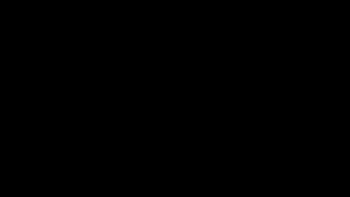

In the past few years, there has been a massive surge in the prevalence of Artificial Intelligence. We have witnessed its evolution
through various forms, be it through text (eg. ChatGPT, Claude, Gemini), imagery (eg. stable diffusion, flux, etc), video
(eg. SORA, Wan, etc), audio generation encompassing both text-to-speech(eg. mini-max) or music generation formats or we may have come across
it through the recently hyped world models. Beyond the vanilla mediums within which we are accustomed with, AI has embedded
itself in technical infrastructure through autonomous coding assistants, scientific research or robotics.

However irrespective of the kind, the underlying architecture of these are fundamentally easy to understand but only a few
understand the underlying architecture of these models work. If we take it at the base level, all these models (text, audio, video)
are built using the same building blocks, once understood every kind of model can easily be understood. In this series of blogs,
I will try to explain each and at the end you will understand it and hopefully build a model regarding a field you are working in.
This will be as easy to understand as ever. The minimum requirement is high-school mathematics. As long as you understand the basics
of matrix arithmetics and calculus, you can follow through. We will also be using the academic papers that first introduced it or
best illustrate the concept to give a real-life understanding of how research are read, so that after this course, you can keep
up to date with the latest research trend in the industry. My primary goal is to give you all the necessary skillset to understand
Artificial Intelligence, so you can augment it to whatever field you are in without overwhelming you will terminologies.

Before beginning, I want to tell you before-hand at the end of each section, an assignment will be given, you may or may-not do it,
but if you do, I just hope you do it on your own, you can use LLMs to clarify some basic concepts but ...

Before beginning, I want to tell you beforehand: at the end of each section, an assignment will be given. You may or may not choose
to complete them, but if you do, I hope you do so on your own. While you are encouraged to use LLMs as a modern-day encyclopedia to
clarify difficult-to-understand concepts, the core of the work should remain uniquely yours. The goal is not just to produce an
answer, but to build your own "internal model" of these technologies. Using an AI to think for you defeats the purpose of this. Use
these tools as a sounding board, but let your own voice and logic lead the way.

The current landscape of Artificial Intelligence, is predominantly led by neural network architecture and followed by that reinforcement learning.
As of late, reinforcement learning plays only a little part of it and since both are fundamentally different.First, let's pound on neural network first, and then after having
a solid understanding of neural networks, we will move to reinforcement learning.

# What is Neural Network?

Neural networks are inspired by how the brain works, where neurons serve as the basic unit and communicate through their synapses with one another.
We've all heard these stories. Let's strip out all the analogies and look at it concretely. First, let's talk about backpropagation.

## Backpropagation

The earliest concrete reference to backpropagation I could find is reference to backpropagation I could find is (the learning representation by
backpropagation paper by Rumelhart, Jeffery Hinton and Ronald Williams)[https://gwern.net/doc/ai/nn/1986-rumelhart-2.pdf]. You may have noticed
Jeffery Hinton from the Turing Awards in 2018, together with Yoshua Bengio and Yann Lecun (which we will talk about later). Though this wasn't
the first to first illustrate backpropagation, it was the first to popularize it.

Essentially, backpropagation is a strategy where a matrix consisting of numbers called **parameters**, are derived from absolutely random data by iteratively updating it
minutely per step until the original matrix is reached.

Assuming, you are given a function, `y = Ax`. Let's assume `x`, the input is a `2x1` matrix, the first
parameter represents the probability a ball is black and the second parameter presents the probability a ball is round. `y`, the result is a `3x1` matrix, the first
parameter represents the probability the ball is in box A and the second parameter is to box B and likewise third in box C. So based on
the shape (dimensions of the matrix) of `x` and `y` we can say that `A` has to be a `3x2` matrix for this to be feasible. In other words, the shape
of x is `(2,1)`, the shape of y is `(3,1)` and the shape of `A` is `(3,2)`.

$$
\begin{bmatrix} y_0 \\ y_1 \\ y_2 \end{bmatrix} = \begin{bmatrix} a_{00} & a_{01} \\ a_{10} & a_{11} \\ a_{20} & a_{21} \end{bmatrix} \begin{bmatrix} x_0 \\ x_1 \end{bmatrix}
$$

so, assuming you are given a table of inputs and output, and you were told to construct a model
of the function, implying you should find `A`. The table

| #   | Input $(x_0, x_1)$ | Output $(y_0, y_1, y_2)$ |
| --- | ------------------ | ------------------------ |
| 1   | (1.0, 0.0)         | (0.60, 0.30, 0.10)       |
| 2   | (0.0, 1.0)         | (0.20, 0.50, 0.30)       |
| 3   | (0.5, 0.5)         | (0.40, 0.40, 0.20)       |
| 4   | (0.2, 0.8)         | (0.28, 0.46, 0.26)       |
| 5   | (0.8, 0.2)         | (0.52, 0.34, 0.14)       |
| 6   | (0.3, 0.7)         | (0.32, 0.44, 0.24)       |
| 7   | (0.6, 0.4)         | (0.44, 0.38, 0.18)       |
| 8   | (0.1, 0.9)         | (0.24, 0.48, 0.28)       |
| 9   | (0.9, 0.1)         | (0.56, 0.32, 0.12)       |
| 10  | (0.4, 0.6)         | (0.36, 0.42, 0.22)       |

<!--  -->

Using this data, we are trying to model this environment by creating the line of best fit, such that given a random input, we can get the closest value of the Output we can possibly get as illustated in the figure.
To do so, there are various means of doing so, but the conventional is to find the total mean and variances across the entire dataset. and using that we can compute a the line of best fit
based on it. but the issue about this is if one data is added into the dataset, the dataset statistical variables (mean and variances) need to be recomputed. This is very expensive to do.
To address this backpropagation was invented, in backpropagation, from either a total zero matrix, one matrix or totally random matrix, we iteratively update it for every data one by one
based on the gradient of the graph until we eventually create the closest approximation of the parameters in `A`. Back then, this was a breakthrough, and it is still used in other fields
outside machine learning, so you may come across it in other fields. This forms the baseline of which machine learning works on.

```
mathematically to compute `A`, given
is the resulting probability that a ball is
, where A is the gradient, which is also a `2x2` matrix, `x`
is the `2x1` input matrix.
```
