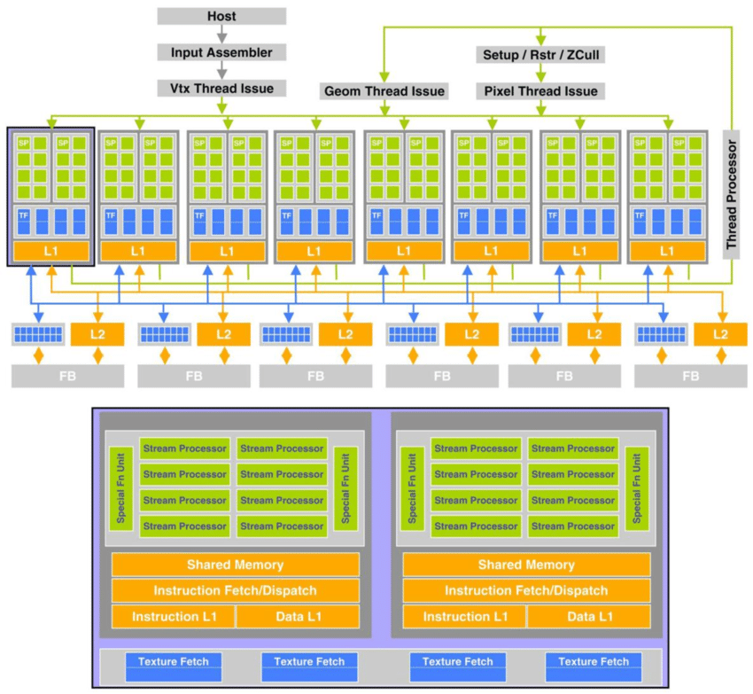

$$
attention = softmax(\frac{Q^TK} {\sqrt {d_k}})V 
$$

## Intro 

Flash Attention was a paper written by Tri Dao et al. in 2022 as a better alternative for running attention mechanisms on NVIDIA GPUs. So far, there have been three iterations of Flash Attention:

- **Flash Attention 1:** The first version was primarily designed for inference. It improved inference speed by about $3×$ while increasing efficiency.
- **Flash Attention 2:** This version utilized CuBLAS libraries to significantly improve speed—by approximately $50\%$ over Flash Attention 1. Additionally, it was as fast in training as it was in inference.
- **Flash Attention 3:** This iteration improves performance on quantized models (i.e., models with FP8 precision). It achieves this through block quantization by interleaving blockwise matrix multiplication and softmax operations.

However, across all iterations, the core approach remains the same: Flash Attention divides attention computation into multiple blocks and processes them in parallel tiles, storing intermediate results in L1 cache (SRAM memory) to avoid recomputation and take advantage of faster memory.

In other words, Flash Attention uses tiling to prevent materialization of the large $N \times N$ attention matrix in slow GPU HBM (High Bandwidth Memory) and instead computes smaller tiles in faster SRAM.

To achieve this, it employs a cumulative approach to computing softmax. Rather than computing softmax in a single step, it computes it incrementally and normalizes the accumulated values to approximate the final softmax result. While this method is reasonably accurate, it can deviate under low-precision training, making it less advisable. Since the publication of Flash Attention, it has been well known for its instability and poorer performance in training scenarios compared to conventional methods.

Flash Attention has been one of the most significant optimization techniques in Machine Learning, particularly for Transformer models, over the past few years. Its performance on NVIDIA GPUs is undeniable, achieving up to **$7-8×$ speed improvements** over baseline GPT-2 performance.

Recently, I read a paper in the [Tenstorrent GitHub repository (tenstorrent/tt-metal)](https://github.com/tenstorrent/tt-metal/blob/main/tech_reports/FlashAttention/FlashAttention.md) on the use of Flash Attention on Tenstorrent hardware. This article serves as my notes as I read through it.

## Understanding

The architecture of Tenstorrent hardware differs from CUDA-based GPUs. At a high level, both approaches distribute computation across multiple simple CPU-like cores that perform arithmetic in parallel and later combine the results. However, CUDA hardware is structured such that each device is divided into blocks, which are further divided into threads. Each thread executes an arithmetic, recieving and sending tasks, and uses the CUDA programming model to efficiently manage these operations by leveraging various levels of  cache.

However, the Tenstorrent **Wormhole** architecture takes a similar but distinct approach. Instead of using a large number of threads that execute tasks in a more linear, 1D manner, Tenstorrent executes operations in a **two-dimensional (2D) Tensix structure**. A **Tensix** consists of five RISC-V-like CPU cores and **1.5MB of SRAM**. Among these cores:

- One core **receives** data from L1 cache into the Tensix,
- One core **sends** data out of the Tensix to L1 cache, and
- The remaining three cores perform the actual computation.

These Tensix units are connected in an **8×10 2D torus** along with additional cores (possibly for communication across Ethernet).

Thus, its programming execution model is quite different from CUDA's. Instead of loading data linearly across threads, it loads data into a **2D grid** to reduce travel time across cores and enable faster computation, which is also performed asynchronously. Unlike CUDA, where a single thread is responsible for reading, writing, and storing tasks synchronously, Tensix divides these tasks across different cores and executes them in parallel and asynchronously.

As a result, its **Flash Attention mechanism** differs significantly from conventional implementations. However, as mentioned earlier, the fundamental approach remains the same: **chunking and tiling $Q, K, V$, then computing and caching intermediate results before performing softmax and summation.**

> After reading all the technical report, I realized that the "flash attention" on the tenstorrent looks more like a asynchronous KV cache than flash-attention itself. 

That's basically it there is nothing more to add after that.  Since KV cache is already known or you can research on it and asynchronous computation in the tenstorrent tensix was already explained. These were the comparisons to control:

## References 

- [1]  [Flash Attention Paper (Tri Dao, 2022, arxiv)](https://arxiv.org/pdf/2205.14135)
- [2]  [Flash Attention 2 Paper (Tri Dao, 2023, arxiv)](https://arxiv.org/pdf/2307.08691)
- [3]  [Flash Attention 3 Paper (Tri Dao, 2024, arxiv)](https://arxiv.org/pdf/2407.08608)
- [4]  [Flash Attention on Tenstorrent Report](https://github.com/tenstorrent/tt-metal/blob/main/tech_reports/FlashAttention/FlashAttention.md)

