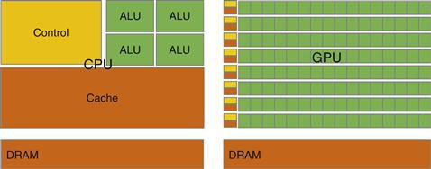
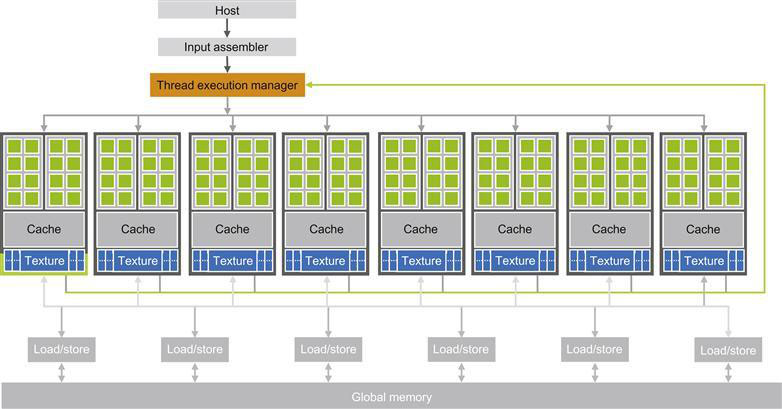
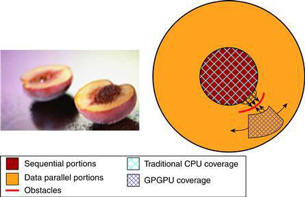
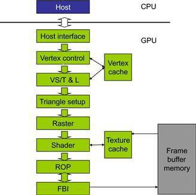

## History

Since 2003, there are two main microprocessor design

- General purpose multicore CPUs
- many-thread GPUs.

## Difference

CPUs
It makes use of control logic to allow instructions from a single thread to execute in and out of their sequential order while keeping the view of its sequential execution. General-purpose multicore CPUs typically have six to eight processor cores and on-chip cache memories. Limited by the memory bandwidth -- rate at which data can be retrieved from memory. Has the large cache memory, low-latency arithmetic units. Has a latency-oriented design.
GPUs
shaped by the video game industry that pushes for performance of floating-point calculations per video frame(FLOPS).
Large chip area while optimizing for power usage.
Optimized to mazimize execution throughput of numerous threads while allowing each thread much longer execution time . This is known as **throughput-oriented design**.
Factors in the choice of processors

- Large Consumer base(Installed base) -- CUDA.
- Practicality and easy accessibility
- Support for IEEE floating standards.

2007- release of CUDA.
Facilitate the ease of parallel programming.

## Architecture of a Modern GPU

- [Mattson2004] - proposed programming models
- [MPI2009](http://www.mpi-forum.org/docs/mpi-2.2/mpi22-report.pdf) - MPI model for scalable cluster computing
- [Open2005](http://www.openmp.org/mp-documents/OpenMP3.1.pdf) - OpenMP for shared-memort multiprocessor systems
  originally designed for CPU arch. consists of a compiler and runtime. An alternative is OpenACC supports multiple computers.

- [Khronos2009](http://www.khronos.org/registry/cl/specs/opencl-1.0.29.pdf) - Open Compute Language(OpenCL), an alternative to CUDA, similar to CUDA, openCL programming model defines language extensions and runtime APIs for parallelism and data delivery manangement.

## TODO

- [x] Computer Architecture
- [x] Parallel programming
- [ ] Scalability across hardware

- [ ] [[History of GPU computing]]
- [ ] Cuda C/  heterogeneous CPU–GPU joint computing/SPMD
- [ ] Floating points, precision, numerical stability
- [ ] Parallel computation patterns
  - [ ] Convolution
  - [ ] Prefix sum/scan
  - [ ] Sparse Matrix Computation
- [ ] Case Study
- [ ] OpenCL
- [ ] OpenACC
- [ ] Thrust
- [ ] CUDA FORTRAN
- [ ] C++AMP
- [ ] MPI-CUDA
- [ ] Dynamic Parallelism

DMA
Modern computer systems use a specialized hardware mechanism called direct memory access (DMA) to transfer data between an I/O device and the system DRAM

An advantage of using a specialized hardware mechanism is that is designed for the primarily to copy data.
DMA is used in data copy operations between a CPU and a GPU.

## Fixed-function Graphics Pipeline

The NVIDIA Geforce Graphics Pipeline is designed to render triangles

Steps

1. CPU transfers Data with the help of DMA to GPU and vice-versa. This requires pinned memory in DRAM
2. the vertex control records the vertices of the triangles and stores it hn a vertex cache for future use.
3. the Vertex shading, transform and lighting (VS/T & L) stage transforms vertex and assign color, normals, texture coordinates ,tangents, ....
4. Raster stage assigns pixels to each triangles per vertex value.
5. the shader stage assigns color through a combination of interpolation of vertex colors, texture mapping, per-pixel lighting mathematics, reflections, and more.
6. Finally a raster operation (ROP) performs color raster operation and also determines visible vertices from occluded ones.
7. Frame Buffer Interface (FBI) mamges memory read and write to display buffer memory.

Programmable processors came to life due to the increasing sophistication of software demands.

- In 2001, the NVIDIA GeForce 3 introduce shader programmability
-
