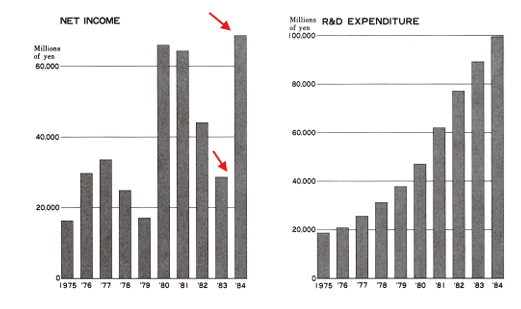

## Introduction

Few innovations have had as profound an impact as the Compact Disc (CD). The Compact Disc (CD) revolutionized the way the world consumed music and data, marking a pivotal moment in technological and cultural history. Initially met with skepticism, CDs rapidly surpassed all expectations, reshaping the music and data storage industries. From its inception in the late 1970s to its dominance in the 1990s and eventual decline in the 21st century, this blog explores the history of CDs, technological innovation, corporate collaboration between Philips and Sony to its eventual dominance, and highlights key milestones in its development and adoption.

## The Genesis of the CD

The story of the CD begins in the 1970s, a time when the vinyl LP (Long Play) record reigned supreme in the music world. Despite its popularity, the LP had several drawbacks. Its analog nature meant that sound quality could degrade over time due to wear and tear, dust, and scratches. The music industry was eager for a solution that could provide better sound quality and durability.

(image of a vinyl Long Play record)

Enter Philips, the Dutch electronics giant. In 1969, a Philips researcher named **Klaas Compaan** suggested using optics to store pictures. This idea evolved, and by 1972, Philips had developed the Video Long Play (VLP) disc format. Although the VLP was primarily designed for video, it laid the groundwork for what would become the CD.

In the mid-1970s, **Lou Ottens**, Philips' technical director of audio (and the inventor of the cassette tape), challenged his team to create a disc that could store and play four high-fidelity audio signals. The project, dubbed "Audio Long Play" (ALP), initially aimed for an analog solution. However, the team quickly realized that to overcome the issues plaguing vinyl records, they needed to go digital.

## The Digital Breakthrough

The shift to digital was a game-changer. By encoding audio data as discrete signals (bits) and etching them onto the disc as a series of pits, **Philips** engineers found they could dramatically improve sound quality and durability. They employed several innovative techniques to achieve this:

1. A clever optical trick: The disc's protective transparent coating was made 1.1 millimeters thick, slightly larger than the 1-millimeter width of the laser beam reading the disc. This meant that dust and small scratches on the protective coating would be out of focus, preserving the integrity of the data beneath.

2. Error correction and concealment: Additional redundant information was burned onto the disk for correcting errors, and sophisticated algorithms were developed to hide errors by extrapolating missing information.

By 1979, Philips had a working prototype of what they now called the "Compact Disc," a name chosen to piggyback on the success of their earlier Compact Cassette.

[Compact disc prototype from The Philips.'VLP' system by K. Compaan and P. Kramer](https://pearl-hifi.com/06_Lit_Archive/02_PEARL_Arch/Vol_16/Sec_53/Philips_Tech_Review/PTechReview-33-1973-178.pdf)

## The Sony-Philips Partnership

Recognizing the need for a global standard, Philips sought a partner to help bring the CD to the world. In a strategic move, they chose **Sony**, a decision that would prove crucial to the CD's success.

The Sony-Philips collaboration was a marriage of complementary strengths. Philips excelled in optical and servo-mechanical systems, while Sony brought expertise in digital technology, particularly digital error correction. The two companies had a history of successful collaboration, having worked together on the Compact Cassette in the 1960s.

From 1979 to 1980, teams from both companies held six meetings to hammer out the CD standard, documenting their decisions in what became known as the **"Red Book"**. Key decisions included:

1. Error correction code: Sony proposed an improved implementation of Philips' original code, which was accepted.

2. Sampling frequency: They settled on 44.1 kHz, chosen for its compatibility with existing PCM (Pulse-Code Modulation) adaptors based on analog video formats.

3. Disc size: After much debate, they settled on a 120-millimeter disc. Contrary to popular belief, this decision was not influenced by the length of Beethoven's Ninth Symphony. Instead, it was a compromise that gave both companies an even start in manufacturing.

## The 74-Minute Mystery

[photo of Kees Schouhamer Immink 2015 faraday medal winner](https://alchetron.com/Kees-Schouhamer-Immink)

One of the most enduring myths about the CD is that its 74-minute playing time was chosen to accommodate Beethoven's _Ninth Symphony_. While this makes for a romantic story, the reality is more practical. The final playing time was a result of the technical limitations and engineering choices during the development of the CD format.

Kees Schouhamer Immink, a key member of the Philips team, developed the Eight-to-Fourteen Modulation (EFM) channel code, which Sony eventually agreed to adopt. This code allowed for greater information density, but it required more space on the disc, pushing the final playtime to 74 minutes and 33 seconds.

The misconception around Beethoven’s _Ninth Symphony_ likely arose because many early adopters of the CD format were classical music enthusiasts. Classical musicians and fans welcomed the CD’s ability to store long, uninterrupted recordings of symphonies, leading to the belief that the format was designed with classical music, specifically Beethoven’s symphony, in mind. However, the actual reason for the 74-minute capacity was purely a result of the technical decisions made during the development process, not a deliberate choice to accommodate any particular musical work.

## Bringing the CD to Market

With the technical specifications finalized, the next challenge was market adoption. Sony and Philips submitted the CD standard to the Digital Audio Disc (DAD) Committee, a group of 29 electronics manufacturers sponsored by Japan's Ministry of Industrial Trade and Industry.

A crucial moment came in January 1981 when Matsushita Electric (now Panasonic -- renamed in 2008) announced they would adopt the CD standard. This decision, coming from one of the world's largest consumer electronics companies, tipped the scales in favor of the CD.

The first CD players hit the market in 1982: Sony's **CDP-101**, priced at $700, and Philips' **Pinkeltje** (after a friendly gnome in Dutch folklore). By the end of 1981, 30 manufacturers had signed on to produce CD players.

[SONY ANNUAL REPORT 1984](https://www.sony.com/en/SonyInfo/IR/library/ar/1984-E.pdf)

## The CD's Rapid Rise

The CD's success was swift and remarkable. Sony America's entire 1984 profit came from its CD production plant in Indiana. Several factors contributed to this rapid adoption:

1. Superior audio quality: While audiophiles debated whether CDs truly outperformed high-end vinyl setups, the average CD undoubtedly sounded better than the average vinyl record played on a typical turntable.

2. Durability: CDs lasted far longer than vinyl records or cassette tapes, which degraded with use.

3. Lack of format war: Unlike the Betamax-VHS battle, the CD faced little competition, thanks to its early lead and backing from major manufacturers.

4. Low licensing fees: Sony and Philips kept licensing fees very low, encouraging widespread adoption.

5. Enhanced user control: CDs allowed listeners to easily skip tracks or repeat favorite songs, offering a level of control previously unavailable.

## Beyond Audio: The CD-ROM

The CD's potential extended beyond music. In 1984, Philips and Sony published the "Yellow Book" standards for the Compact Disc Read Only Memory (CD-ROM), adapting the technology for computer data storage.

In 1985, major computer manufacturers, along with Microsoft, Sony, and Philips, met at the High Sierra Hotel and Casino in Nevada to develop a standard for storing files on CDs. This led to the ISO 9660 standard, released in 1988, which set the international standard for organizing files on a CD.

The first PC CD-ROM drives appeared in 1990, initially priced around \$300. As Taiwanese and Korean manufacturers entered the market, prices plummeted, reaching \$100 by 1995. This price drop made CD-ROM drives ubiquitous in personal computers, setting the stage for the CD's next chapter.

## The CD's Golden Age and Decline

The 1990s marked the golden age of the CD. Record labels reaped enormous profits, thanks in part to favorable deals with artists and, more controversially, alleged price-fixing within the industry that kept CD prices artificially high.

However, the very technology that made CDs so successful also sowed the seeds of their decline. The widespread adoption of CD-ROM drives in personal computers meant that users could now easily read audio CDs on their computers. This opened the door to digital music copying and sharing.

The launch of Napster in June 1999 marked a turning point. Suddenly, music fans could easily share digital copies of their CDs over the internet. The music industry, caught off guard by this technological shift, struggled to adapt.

The rise of MP3 players, culminating in Apple's introduction of the iPod in 2001, further accelerated the CD's decline. Consumers increasingly preferred the convenience of digital files over physical media.

## Legacy and Future

Despite its declining sales, the CD's impact on music and technology cannot be overstated. It ushered in the digital audio era, paving the way for subsequent innovations like MP3s and streaming services. The CD-ROM's data storage capabilities were crucial in the personal computer revolution of the 1990s.

Today, while CDs are no longer the dominant music format, they maintain a niche market. Some audiophiles and collectors still prefer CDs for their perceived audio quality and tangible nature. The format also remains important in certain markets and for archival purposes.

As we look to the future, the CD stands as a testament to the power of technological innovation and international collaboration. Its rise and fall mirror the rapid pace of change in the digital age, reminding us that even revolutionary technologies may one day be superseded. Yet, the principles of digital audio pioneered by the CD continue to shape how we experience music today.

The story of the CD is not just about a piece of technology; it's about how innovation can transform industries, shape cultural experiences, and connect people through the universal language of music. As we stream our favorite songs today, we owe a debt of gratitude to those shiny discs that first brought digital clarity to our ears.
