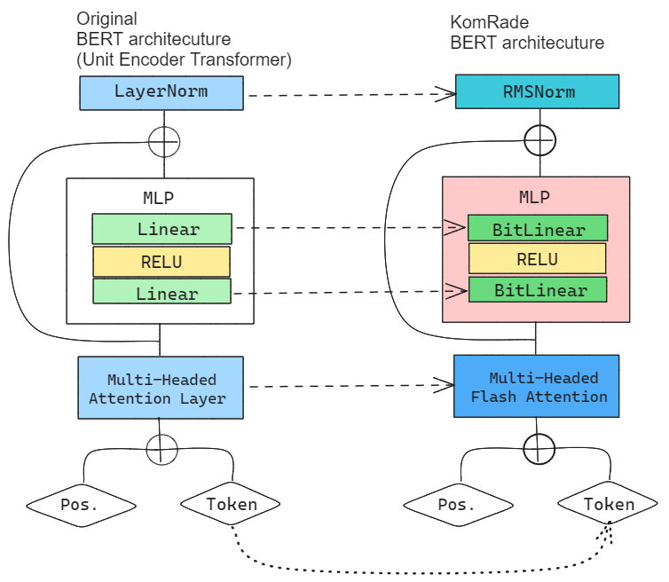
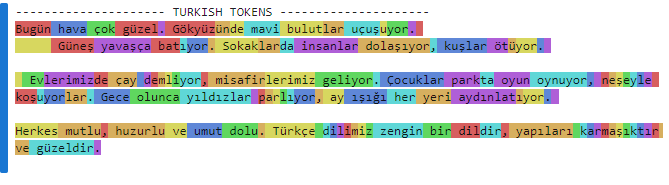
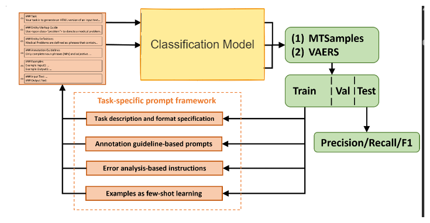

## Aim

The aim of this project is to develop accurate and efficient Named Entity Recognition (NER) models specifically tailored for mammography radiology reports in the healthcare sector. The primary objectives include:

- Development of NER Models in mammography radiology reports
- Establishing usable and effective NER models in the health sector
- Finding solutions to accurately extract important information from textual reports

## Introduction:

**Named-entity recognition** (**NER**) (also known as **(named)** **entity identification**, **entity chunking**, and **entity extraction**) is a subtask of [information extraction](https://en.wikipedia.org/wiki/Information_extraction "Information extraction") that seeks to locate and classify [named entities](https://en.wikipedia.org/wiki/Named_entity "Named entity") mentioned in [unstructured text](https://en.wikipedia.org/wiki/Unstructured_data "Unstructured data") into pre-defined categories.

In this context, the focus is on mammogram radiology reports, which are documents generated by radiologists summarizing the findings from mammogram screenings, which are used for breast cancer detection.

By applying NER techniques to these reports, the goal is likely to automatically identify and extract relevant information such as patient names, dates, medical conditions, anatomical terms, and other entities of interest. This can have various applications including improving information retrieval, aiding in decision support systems, or facilitating data analysis in medical research.

Over the past couple of years, the transformer ecosystem of NER models has become diverse. With the scale and accomplishments of pre-training decoder models such as GPTs, Claude, Gemini, and Llama, in the field of text generation, the efficacy of fine-tuning models is predicted to surpass that of their pre-trained counterparts.[1](https://arxiv.org/abs/2306.13841) However, exceptions exist, as observed in some fields.[2](https://arxiv.org/abs/2303.16416)

| Pretraining model (Option A)                                                                                                                          | Finetuning models (Option B)                                                                                                                  |
| ----------------------------------------------------------------------------------------------------------------------------------------------------- | --------------------------------------------------------------------------------------------------------------------------------------------- |
| The architecture of encoder-based favors NER models                                                                                                   | Practically all LLMs Uni-directional in nature limiting its context awareness. However there are some exceptions like BioMedicalBERT.         |
| Trained from scratch, may be limited and struggle with outliers.                                                                                      | Metrically, LLMs are likely to perform better on one-shot prompts and likely to handle unconventional or biased prompting better              |
| Training from scratch, is **Resource-intensive**. and requires large amount of annotated data which might be challenging especially for only Turkish. | requires less data. LORA, and other finetuning techniques have made finetuning relatively cheaper but with comparatively similar performance. |
| It may not capture domain-specific nuances. Gives ability to rebuild token embedding for Turkish without resulting in domain mismatch                 | pretrained primarily on mostly english dataset. Also token embedding might be biased on english tasks and may falter on turkish corpora.      |

Ultimately, we faced a divide in deciding between the two options. Option A boasts higher accuracy albeit at a greater expense, while Option B, though less tailored to Turkish language specifics, offers a more cost-effective alternative. Consequently, we opted to develop two distinct architectures to accommodate both considerations.

## Architecture

### Option A

Over the years, the past couple of years since Transformer was first published and BERT being one of the first among them, there has been a lot of improvement across each layer. We have made some changes to the original architecture for efficiency. Above a simplified example of the BERT and our improvements.

1. TrBPE
   One of the main reasons why most AI architecture struggle with foriegn language other than english is that the token encoding is english-first. Whilst, it may be performant across other languages like Turkish, its inference doesn't neccessarily follow the grammatical structure of that language and thereby lag in performance compared to English,[4](https://www.cmpe.boun.edu.tr/~gungort/theses/A%20Comprehensive%20Analysis%20of%20Subword%20Tokenizers%20for%20Morphologically%20Rich%20Languages.pdf) Say, the Turkish BERT transformer tokens on Huggingface,
   
   For instance looking at this visual representation of a tokenized piece of text by Huggingface/tokenizer, some words, like _evlerimizde_ are split properly as _ev-lerimiz-de_, and _koşuyorlar_ as **koş-u-yor-lar.** These word splits are accurate based on the turkish grammar however for some it either doesn't split at all or splits too much. such as, _yapıları_ remains the same, and _karmaşıktır_'s split is basically character based. Due to this fact, the context aren't fully understood during training.

   We intend to develop **trBPE**, a byte pair encoder specifically designed for Turkish, considering the agglutinative nature of the language. We deduce this may improve our overall performance of the model

2. BitLinear
   BitLinear is a layer derived for the paper "BitNet: Scaling 1-bit Transformers for Large Language Models"[3](https://arxiv.org/abs/2310.11453). BitLinear is a drop-in replacement of the linear layer in order to train 1-bit weights. BitLinear has competitive performance while substantially reducing memory footprint and energy consumption. Furthermore, BitLinear exhibits a scaling law akin to full-precision Transformers, suggesting its potential for effective scaling to even larger language models while maintaining efficiency and performance benefits.
   This is currently being adopted by Microsoft [5](https://arxiv.org/abs/2402.17764) . Though this is experimental, we may try it, due to the fact that it quantizes it on {-4, 0, 4} base point which may be helpful in classification related task like this.

3. Flash-attention
   Flash attention 2.0 is an alternative to the conventional attention layer. It is an IO aware attention mechanism which leverages the structure of the NVIDIA GPUs to achieve : 15% end-to-end wall-clock speedup on BERT, 3× speedup on GPT-2, 2.4× speedup on long-range arena, whilst maintaining its high accuracy.[6](https://arxiv.org/abs/2205.14135)

4. RMSNorm
   Normalization layers, have evolved over the years. RMSNorm used in LLama architecture is one of the best normalization layers available. It merely rescales the distribution but doesn't recenter. Since we are running a bitLinear layer, a recentering is fairly achieved at zero. It has lesser parameters that the conventional `nn.LayerNorm`.[7](https://arxiv.org/abs/2307.09288)

The introduction of a new tokenizer may lead to an indeterministic increase in token size(sequence length). However, modifications to the Linear Layer and `nn.LayerNorm` could reduce parameters by 20-50%, potentially mitigating computational costs.
This new architecture, we hope with the help of quantization and using relatively lesser parameters will lead to high accuracy but lower cost.

### Option B (Finetuning architecture)

 [2](https://arxiv.org/abs/2303.16416)

Inference and prompt engineering, is one of a sensitive task in the use of AI especially in the field of medicine, where indeterministic are highly preferred over wrong results. This is usually due to the task being obscure tasks. The paper "Improving Large Language Models for Clinical Named Entity Recognition via Prompt Engineering"[2](https://arxiv.org/abs/2303.16416) introduces a method of prompt engineering, achieving accuracy of >90% on BERT tokenizer. The paper introduces a prompt framework by

1. **Baseline Prompts with Task Description and Format Specification:** These prompts serve as foundational templates, outlining the task's description and specifying the desired format. They provide a starting point for prompt customization and refinement.

2. **Annotation Guideline-based Prompts:** Drawing insights from established annotation guidelines, these prompts are tailored to align closely with the specific requirements and intricacies of the named entity recognition task in clinical contexts.

3. **Error Analysis-based Instructions:** Leveraging the findings from error analysis, this approach tailors prompts to address common pitfalls and challenges encountered during model inference, thereby enhancing overall performance and robustness.

4. **Annotated Samples for Few-shot Learning:** By incorporating annotated samples into the prompt framework, the model gains the ability to adapt and generalize effectively, even when confronted with limited labeled data, thus mitigating the data scarcity challenge.

The effectiveness of each prompt is rigorously assessed, and the resulting models are benchmarked against Option A.

## Analysis

Based on this we hope to to build a NER Models from for mammography radiology reports that is less computatively expensive whilst highly accurate results. Using two methods

- Through the pretraining the KomRade architecture (Option A)
- Finetuning BioClinicalBERT using turkish dataset. (Option B)

We are expect ~85% accuracy result in Option B. However, uncertain on Option A, since it is a novel architecutre

Evaluation metrics will determine the most effective approach.

This report outlines the objectives, architectural modifications, and methodologies for developing NER models using the KomRade architecture. By leveraging advancements in transformer technology and adopting tailored approaches, we aim to contribute to the development of efficient and accurate NER models in the healthcare sector.

## References:

1. Brando, Miranda, et al. "Is Pre-Training Truly Better than Meta-Learning?" _arXiv preprint : arXiv:2306.13841_ (2023). [Link](https://arxiv.org/abs/2306.13841)

2. Yan, Hu, et al. "Improving Large Language Models for Clinical Named Entity Recognition via Prompt Engineering." _arXiv preprint arXiv:2303.16416_ (2023). [Link](https://arxiv.org/abs/2303.16416)

3. Erencan Erkaya, et al. "A Comprehensive Analysis of Subword Tokenizers for Morphologically Rich Languages." _Institute for Graduate Studies in Science and Engineering-Bogazici University_ 28.4 (2022): 78-91. [Link](https://www.cmpe.boun.edu.tr/~gungort/theses/A%20Comprehensive%20Analysis%20of%20Subword%20Tokenizers%20for%20Morphologically%20Rich%20Languages.pdf)

4. Hongyu Wang, et al. "BitNet: Scaling 1-bit Transformers for Large Language Models." _arXiv preprint arXiv:2310.11453v1 (2023)_. [Link](https://arxiv.org/abs/2310.11453)

5. Shuming Ma, et al. "The Era of 1-bit LLMs: All Large Language Models are in 1.58 Bits." _arXiv preprint arXiv:2402.17764_ (2024). [Link](https://arxiv.org/abs/2310.11453)

6. Tri Dao, et al. "FlashAttention: Fast and Memory-Efficient Exact Attention with IO-Awareness" _arXiv preprint arXiv:2205.14135_ (2022). [Link](https://arxiv.org/abs/2205.14135)

7. Hugo Touvron, et al. "Llama 2: Open Foundation and Fine-Tuned Chat Models" _arXiv preprint arXiv:2307.09288_ (2023). [Link](https://arxiv.org/abs/2307.09288)
