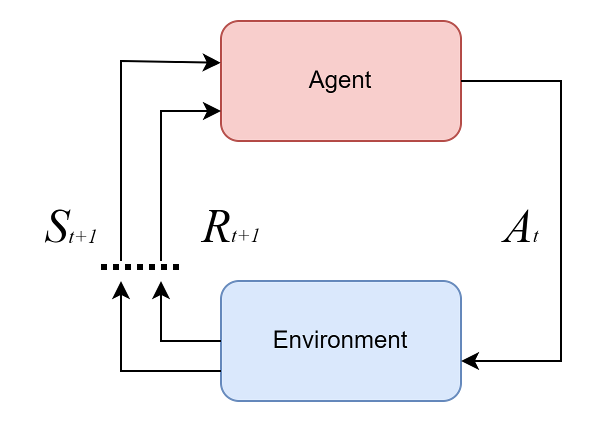
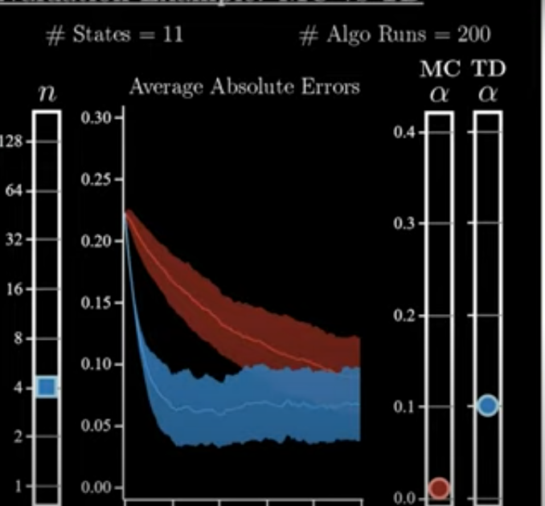

these are notes from my understanding from the reinforcement by the book. Using this youtube series to complement it. 


[youtube video](https://www.youtube.com/watch?v=NFo9v_yKQXA&list=PLzvYlJMoZ02Dxtwe-MmH4nOB5jYlMGBjr) | [the book (reinforcement learning by Sutton and Barto)](#)

## Intro
### Opinions Before Reading

- Deep RL doesn't work


### Topics to cover
- [x] Bellman Equations, Dynamic Programming and Generalized Policy Iteration
- [x] Monte Carlo and Off-policy methods
- [x] Temporary Difference, Sarsa and Q-learning
- [ ] Function Approximation
- [ ] Policy Gradient Methods


### What is Reinforcement Learning? 
- The problem statement

Reinforcement learning starts with an agent(representing that which learns) which takes an action, $A_t$ at each moment of time $t$ within an environment to produce the subsequent next state, $s_{t+1}$ , as well as the reward for taking the action $R_{t+1}$. These ($S_{t+1}, R_{t+1}$) is then  passed back into the agent for the next action to be decided. This is a cyclic process that begins with the agent and with the environment. This is a cyclic process that begins with the agent and with the environment until a finite state is reached. 



- **Time** is discrete 
- Uppercase letters represent **Random Variables**, while lowercase letters are possible values (e.g., $s \in S$, $a \in A(s)$, $r \in R \in \mathbb{R}$)

The dynamics of the agent-environment interaction are defined as: $$ p(s', r | s, a) = \text{Prob}(S_{t+1} = s', R_{t+1} = r | S_t = s, A_t = a) $$


from this, we deduce that the current state and reward depends of the immediate past state and action not the history of states and actions. This is the same just as in all state space models. This is also called the ___Markov Property___. 

The agents behaviour is also known as the policy and its geven by $\pi(a | s)$.  It basically tells us the action an agents will take at a particular state. However, need to take not that if the policy has no randomness then only one action can be taken at a particular state ie $a = \pi (s)$ or in other words 

$\pi (a | s) = \pi(s) + \delta$ where $\delta$ is randomness per the state. Note, these randomness may or not follow a gaussian distribution.

### What makes for a good policy?
When the cumulative policy across all states is the optimum. In other words when the policy has a good return. The return, $G_t$ is defined  as $\sum^{T}_{k=t+1} \gamma^{k-t-1} R_k$. where $\gamma$ is the discounting factor. This discounting factor is analogous to the value of money of money across time.  That is current rewards are valued much higher that its predecessor.

$$
G_t\ = \sum^{T}_{k=t+1} \gamma^{k-t-1} R_k
$$
As said earlier, the goal is to get a good policy and to get a good policy you need to get the most optimum return. ie

$$
Target\ =\ \max_{\pi} \mathbb{E}_{\pi}[G_t]
$$ 
### value function
They are of two kinds
1. State value function
2. Action Value function

the goal, as said earlier is also called the optimum value function, however the value function is of two kinds

The **state value function** which, in this case finds the value function conditioned on a particular state. And as this, is done it finds the maximum policy for every particular state.

The **optimum state value function** is the maximum state or action value function and defined as such:
$$
v^* = \max_{\pi \in S} v_\pi (s) 
$$

and in this case the state value function is 

$$
v_{\pi}(s) = \mathbb{E}_{\pi}[G_t\ |\ S_t = s] 
$$

Also the second kind is the **action value function**, is basically the same as the state value function just that it is conditioned by both the state and the action. that is;

$$
q_\pi(s, a) = E_\pi[G_t | S_t = s, A_t = a]
$$

and after that similarly the **optimum action value function** for each state and action pair. ie.
$$
q^* = \max_{\pi \in (S, A)} q_\pi (s, a) 
$$

So in general,
> We say a policy is optimum if its value function achieves the highest possible return for all states (for all state-action pair for action value functions)

### Assumptions
- We assume that we have at least one optimum policy
- Be it using state value function or action value function they both converge to produce the same optimum value function and in turn the same policy. 
- The environemnt is deterministic that is the environment fully determines all possible next states and rewards. And also these state and actions can be tabularized.
- Also, our assumption of the environment is complete. That is we have full knowledge of the environments dynamics. ie $p(s', r| s, a)$


## Bellman Equations

### What is dynamic programming? 
Dynamic Programming (DP) is a method for solving recursive algorithms, and in RL, it is used to find the optimal policy

The current return can be assumed to be the sum of the next reward and the next return discounted.

$$
G_t = R_{t+1} + \gamma G_{t+1}
$$

### What is the relationship between state value function and the action value function?
The relationship between the value function at a state and the action value function is given by the **Bellman Optimality equations**. 

The first equation states that the value at state, $s$ following a policy, $\pi$ is the sum of all the product of the policy with the action value function at s. that is;
$$
v_\pi (s) = \sum_{a \in A(s)} \pi(a | s)\ q_\pi (s, a) 
$$
where $\pi(a|s)$ is the agent's policy for a given state. This equation tells the relationship between state and action value function. 

however for the second equation, it state that the action value at a state for an action is the cumulative sum of the product of the environment's dynamics and the return at that time step, $t$. and for for the action value function it can be assumed that 
$$
q_\pi(s, a) = \sum p(s', r| s, a)G_{t}
$$
where $p(s', r | s, a)$ represent the environment's dynamics( also called the transition probability)

### What is the difference between transition probability and the policy

the policy, $\pi(a|s)$ is determined by the agent. The policy is basically how an agent reacts in a particular state

The transition probability, $p(s', r| s, a)$ is the determined by the environment. it is the probability distribution that determines the reward the agent should get when in a particular state. It is also called the reward model. Or the environments dynamics.


So to elaborate on the second bellman optimality equation.

$$
q_\pi(s, a) = \sum p(s', r| s, a)G_{t+1}
$$
can also be written as
$$
q_\pi(s, a) = \sum p(s', r| s, a)[r + \gamma G_{t+1}]
$$
where 

$$
v_{\pi}(s') = \mathbb{E}_{\pi}[G_{t+1}\ |\ S_t = s'] 
$$
but let us assume that,
$$
v_\pi(s') = G_{t+1}
$$

I agree this sounds silly, once is a random variable and one is probability, how can they be equal but so is what the second bellman equation states. So putting it back into the initial equation.
$$
q_\pi(s, a) = \sum p(s', r| s, a)[r + \gamma v_\pi(s')]
$$

So gathering both equations we get
$$
\begin{gather}
v_\pi(s) = \sum_{a} \pi(a | s) q_\pi(s, a) \\
q_\pi(s, a) = \sum_{s', r} p(s', r | s, a) \left[ r + v_\pi(s') \right]
\end{gather}
$$

substituting one into another we get these equations.
$$
\begin{gather}
v_\pi(s) = \sum_{a} \pi(a | s) \sum_{s', r} p(s', r | s, a) \left[ r + \gamma v_\pi(s') \right] \\
q_\pi(s, a) = \sum_{s', r} p(s', r | s, a) \left[ r + \gamma \sum_{a'} \pi(a' | s') q_\pi(s', a') \right]
\end{gather}
$$

 These are usually the equations given when thought of bellman equations. A bit too much algebra but will get use to it in time. 

Also after these are calcuated they are used to find the optimal value function, which is simply the maximum state value function or the maximum action value function.
So in summary, 
- The **policy** is determined by the agent's behavior, i.e., how the agent reacts to a particular state. 
- The **transition probability**, $p(s', r | s, a)$, is determined by the environment and describes the probability distribution for rewards when the agent takes an action in a particular state.
%% Though these are fundermentally the equations used in      %%
## Generalized Policy Evaluation
This is a generalized algorithm for computing either the state value function or the action value function given a policy $\pi$ by iterating and updating over it.

$$
\pi_0 \xrightarrow{I} v_\pi(0) \xrightarrow{E} \pi_1 \xrightarrow{I} v_\pi(1) \xrightarrow{E} \ldots \xrightarrow{E}  \pi_* \xrightarrow{I} v_*(x)  
$$

>"Generalized policy iteration refers to the general idea of letting *policy  evaluation* and *policy improvement* processes interact independent of the granularity and other details of the two proceses. Almost all reinforcement learning methods are described as generalized policy iteration." ~ ***Barto and Sutton***

So basically, policy iteration is the process of making several sweeps over the policy until the value function stops changing.

for policy improvement, one way to improve the policy is to use value iteration. To iterate over the value until the policy stop changing. 

### so how can you use both?
There are a set of methods for computing both the value function and the policy until both plateau to an optimum value function and policy. This generalized method is called *Generalized policy evaluation*. This follows a exploitation and exploration methods to compute the optimum policy.

## Monte Carlo Methods
In this, we assume we don't know the environment's dynamics, $p(s', r | s, a)$. We merely use the average expected value function, and use generalized policy iteration to obtain the approximated opimum policy from the averages. This method is kind of kinky but works for finite samples.

**Note: Monte Carlo dos not predict environment's dynamics $p(s', r| s, a)$, it jsut leverages the GPI methods assuming the value function using its averages. So in other words Monte Carlo is a *model-free approach* to computing the optimum policy and value function**


### Assumptions in Monte Carlo Evaluation
- Expressing $q_\pi-estimation$ as $v_\pi-estimation$. This is a generalization and simplifies our analysis. Also based on this our process is no longer a MDP but a MRP (a MDP without actions).

Also, the formula for the value functions which we are approximating as the averages is given by

$$
v_\pi(s) = \mathbb{E}[G_t | S_t = s] \approx \frac {1} {C(s)} \sum_{m=1}^{M} \sum_{\tau=0}^{T_m - 1} \mathbb{I}[s_\tau^m = s]g_\tau^m
$$

which basically says we are summing across all trajectories (episodes) and also summing up across all states, for product of the reward at episode m at state $\tau$ and the indicator function, $\mathbb{I}[s_τ^m​=s]$ is an **indicator function** that equals 1 if the state at time step $\tau$ in episode $m$ is $s$, and 0 otherwise. averaged over $C(s)$ is the total number of times state $s$ has been visited across all sampled episodes.

So basically in this method we approximate the value function by averaging returns from sample trajectories across all states. Instead of computing the expectation directly (which may be intractable), we rely on observed experience and average the rewards obtained from visiting $s$.

After this the value function is updated after each sampled episode, $m$. This is called the ***update rule***. 

$$
V(s^m_t) \leftarrow V(s^m_t) + \frac {1} {C(s^m_t)}(g_t^m -V(s^m_t))
$$

However, the $\frac {1} {C(s_t^m)}$ is always taken as a constant called the learning rate/step size $\alpha$ . In this case we call this kind of Monte Carlo evaluation as **constant-$\alpha$ Monte Carlo Evaluation.** the main reason for using a constant alpha MC, is for stability and also similar to the discount factor is a reward function, it is discounted across time, which may be beneficial in plateauing at an optimum. 
So


$$
V(s^m_t) \leftarrow V(s^m_t) + \alpha (g_t^m -V(s^m_t))
$$

$\alpha$ has a trade-off, if small, arrives slowly to the optimum but much more stable. if large arrives quickly but unstable. This is analogous to learning rate in supervised learning(back propagation) techniques. 


### exploration-exploitation tradeoff.
Exploration increases knowledge, exploitation deepens knowledge. larger the environment the higher the exploration and the smaller the environment, the higher the exploitation;
In exploiation the optimum policy is given by
$$
\pi_* = \arg\max_{\pi \in S} v_\pi (s) 
$$

However in exploration we randomly 

$$
\pi_* =  \arg rand_{\pi \in S} v_\pi (s) 
$$

Usually exploration and exploitation is managed using $\epsilon$. This method is known as $\epsilon$-greedy policy of $Q$


```python
import numpy as np

class EpsilonGreedyMethod:
    def __init__(self, n_actions, epsilon=0.1, alpha=0.1):
        self.n_actions = n_actions
        self.epsilon = epsilon
        self.alpha = alpha
        self.q = np.zeros(n_actions)  # Action-value function Q(s, a)
        self.visits = np.zeros(n_actions)  # Keeps track of action visit counts

    def select_action(self):
        # Epsilon-greedy policy for action selection
        if np.random.rand() < self.epsilon:
            return np.random.choice(self.n_actions)  # Exploration
        else:
            return np.argmax(self.q)  # Exploitation

    def update(self, action, reward):
        # Update the Q-value using Monte Carlo method
        self.visits[action] += 1
        self.q[action] += self.alpha * (reward - self.q[action])


# Example usage
def monte_carlo_on_policy(n_episodes=1000):
    agent = EpsilonGreedyMethod(n_actions=4, epsilon=0.1, alpha=0.1)
    rewards = []

    for episode in range(n_episodes):
        episode_rewards = 0
        state = 0  # Placeholder state
        done = False
        
        while not done:
            action = agent.select_action()
            reward = np.random.randn() # Simulating a reward for the action
            
            agent.update(action, reward)
            episode_rewards += reward
            done = True  # Terminating after one step (for simplicity)

        rewards.append(episode_rewards)
    
    return agent.q, np.mean(rewards)

q_values, average_reward = monte_carlo_on_policy()
print("Action-Value Function (Q-values):", q_values)
print("Average Reward:", average_reward)

```


However sometimes, the monte carlo evaluation is done of policy in this instance, the Q tables are different. The behavioural policy that is used to tell the state is updated only periodically. While the target policy is updated every iteration

```python
import numpy as np

class EpsilonGreedyOffPolicy:
    def __init__(self, n_actions, epsilon=0.1, alpha=0.1):
        self.n_actions = n_actions
        self.epsilon = epsilon
        self.alpha = alpha
        self.q_target = np.zeros(n_actions)  # Target policy action-value function Q_t(s, a)
        self.q_behavior = np.zeros(n_actions)  # Behavior policy action-value function Q_b(s, a)

    def select_action_behavior(self):
        # Behavior policy for action selection (epsilon-greedy)
        if np.random.rand() < self.epsilon:
            return np.random.choice(self.n_actions)  # Exploration
        else:
            return np.argmax(self.q_behavior)  # Exploitation

    def update(self, action, reward, behavior_action):
        # Update the target policy action-value function using importance sampling
        importance_sampling_ratio = 1 / (self.epsilon if action == behavior_action else (1 - self.epsilon))
        self.q_target[action] += self.alpha * importance_sampling_ratio * (reward - self.q_target[action])

        # Update the behavior policy action-value function using standard MC method
        self.q_behavior[behavior_action] += self.alpha * (reward - self.q_behavior[behavior_action])


# Example usage
def monte_carlo_off_policy(n_episodes=1000):
    agent = EpsilonGreedyOffPolicy(n_actions=4, epsilon=0.1, alpha=0.1)
    rewards = []

    for episode in range(n_episodes):
        episode_rewards = 0
        state = 0  # Placeholder state
        done = False
        
        while not done:
            behavior_action = agent.select_action_behavior()
            reward = np.mean(rewards) if len(rewards) != 0 else np.random.randn() # Simulating a reward for the action
            
            agent.update(behavior_action, reward, behavior_action)
            episode_rewards += reward
            done = True  # Terminating after one step (for simplicity)

        rewards.append(episode_rewards)
    
    return agent.q_target, agent.q_behavior, np.mean(rewards)

q_target_values, q_behavior_values, average_reward = monte_carlo_off_policy()
print("Target Policy Action-Value Function (Q-values):", q_target_values)
print("Behavior Policy Action-Value Function (Q-values):", q_behavior_values)
print("Average Reward:", average_reward)

```

## Temporal Difference Learning

> If one has to pick one idea central to reinforcement learning, it will undoubtedly be *Temporal difference learning*.
> ~ Barto, Sutton.

Subtopics
- [x]  Q learning
- [ ] Sarsa
- [ ] Expected Sarsa

### Things to take note in Temporal Difference
 - An episode must complete before values can be updated.

Basically Temporal diference learning in general is based on the monte carlo evaluation process as studied  in previous chapter.

As in the monte carlo approach we used this *update rule*:

$$
V(s^m_t) \leftarrow V(s^m_t) + \alpha (g_t^m -V(s^m_t))
$$
where:
$s_t^m$ is the state at time $t$ of the $m$th episode.
$g_t^m$ is the return/target. It is what we move our estimate towards on each step, $t$. 

However in temporal difference learning rather than the return $g_t^m$ representing the total accumulated discounted gain, it should represent only the past n steps and the remaining previous steps, is set as an approximation. ie

$$
g^m_t = r^m_{t+1} + \gamma r^m_{t+1} + \gamma^{2} r^m_{t+1} + \ldots +  \gamma^{n-1} r^m_{t+n-1} +  \gamma^{n} r^m_{t+n}
$$

rather than having the above, usually in the situation when all the gain is not known it is used as this for a `n-step temporal difference`.

$$g^m_{t:t+n} = r^m_{t+1} + \gamma r^m_{t+1} + \gamma^{2} r^m_{t+1} + \ldots +  \gamma^{n-1} r^m_{t+n-1} +  \gamma^{n}V(s_{t+n}^m)
$$

as seen in this case, we are making another assumption that though we don't know all the gains. we can use use the addition of the sum of the discounted rewards to the $n$th step,  and the discounted value estimate to approximate the remaining rewards.

Conditions for setting n
- `n>1` n must be greater than 1, if not n will be eager to make updates. 
- `n < inf` n must be less than infinity. Basically the this temporal difference learning is identical to a Monte Carlo evaluation. 
- Also the use of value estimate, $V(s_{t+n}^m)$ in the return, $g^m_{t:t+n}$ is called **Bootstrapping**.
- the smaller the `n` the more sensitive it is to update. the larger the n, the more computation is required and the slower it "learns".

### Comparison between Temporal Difference and Monte Carlo
- Only one hyperparameter is necessary in a Monte Carlo whereas two are needed in Temporal difference $n, t$
- On graphic comparison between MC and TD. TD is the blue, and MC is the red. TD reaches faster and it is generally nuch better. It took much more runs $\times5$ for runs for MC to reach comparable performance to TD. 


*should recreate better graphs*

- In practice, achieving this on the first try is a facade. You need the right `n` and $\alpha$ to take care of. This gives a leverage to TD, since practically you have one more variable to get the best performance. However, it is a lot more complex to navigate especially for a novice. For Monte Carlo, though simple, difficult to get much more performance out of it.
- Also the higher the value of `n`, the closer the value of $\alpha$ of either approach, (MC and TD) get. In other words with a high value of n, the step size of TD approaches that of MC. 

### Why does TD perform better than MC?
... 
*to be continued*